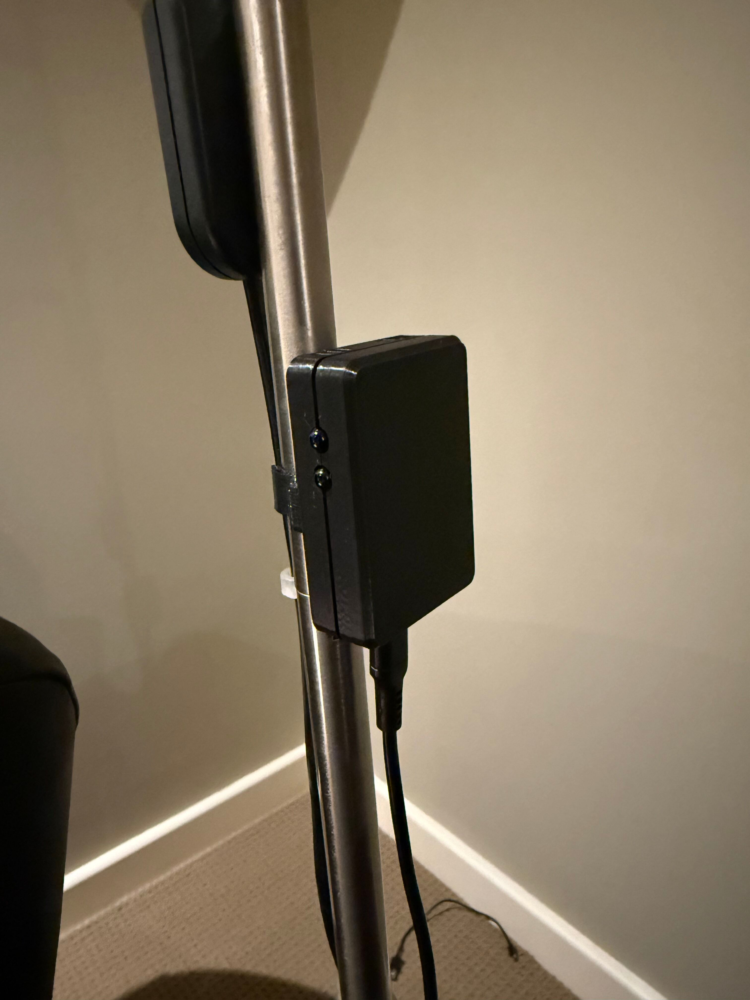
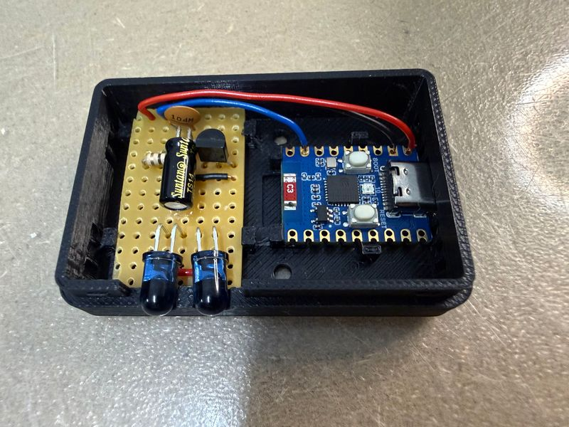

# blaster

A simple dumb IR blaster that can be placed inconspicously at the back of a room
providing a way to blast IR from any Wifi enabled device.



## Build the Circuit

The IR transmitter circuit is easy to build on a small piece of veroboard:

Parts:

* C1 - 100nf ceramic cap
* C2 - 47uF electrolytic cap
* R1 - 680R
* R2 - 22R (or 10R, or 5R)
* BC337 NPN transistor
* 2x IR LEDs (like [these](https://www.jaycar.com.au/5mm-infrared-transmitting-led/p/ZD1945))
* Veroboard 13x8 pins
* [Waveshare ESP32-C3 Zero](https://www.waveshare.com/wiki/ESP32-C3-Zero)


Notes: 

* the above diagram shows a jumper J1 - it's just for labelling where to solder the wires that go to the ESP32.
* don't forget the two cut tracks indicated by red X
* if I was to rebuild this I'd probably move the red jumper wire at the left to just to the right of the LEDs.
* The leads to C2 need to be bent and the cap "laid down" to fit in the case (see photo below)
* The IR LEDs leads need to be bent so they face out the left side of the diagram. (see photo below)
* Leave the veroboard slightly oversized and file down later to fit the snap-in clips in the case.




## Print the Case

This case supports IR transmitter circuitry only.  A version with IR receiver is not yet available.


The case consists of three parts:

* [Top](./case/irtxcase-top.3mf)
* [Bottom](./case/irtxcase-bottom.3mf)
* [Clamp](./case/irtxcase-clamp.3mf)

You'll need a well calibrated printer to get the boards to clip in and the case to snap closed nicely.

The clamp is designed for a 15mm pole and requires:

* two M2.5 heat set inserts 
* two M2.5 6mm screws.

Or, design your own clamp for whereever you want to mount it to. The mounting holds are 26mm center-to-center. 

Fusion and 3mf files are the in the [./case](./case) subdirectory.

I printed the case in PLA, and the clamp in PETG.  You might be able to print it in ABS but I found the board clips too fragile.


## Connect the ESP32

There are three wires from the ESP32 Zero to the IR transmitter circuit.  

* The IR transmitter connection points are shown in the above stripboard image.

* The ESP32 Zero connections are to 5V and GND at the top left and signal to GPIO 4:

    


## Configuring the Device

Once the firmware has been built and flashed to the device ([see here](..)) the network
and GPIO pins need to be configured.  Use a serial terminal program (eg: ttsm) to connect
to the device and enter the following commands:

```
setwifi mynetwork mypassword
gpio 10 rgb
gpio 4 irtx
reboot
```

Once rebooted, the onboard LED should show connection status (green if connected).

Test the device by sending IR commands using irtx-node

```
# Send Yamaha receiver power toggle...
npx toptensoftware/irtx-node send NEC:0x7e8154ab
```

