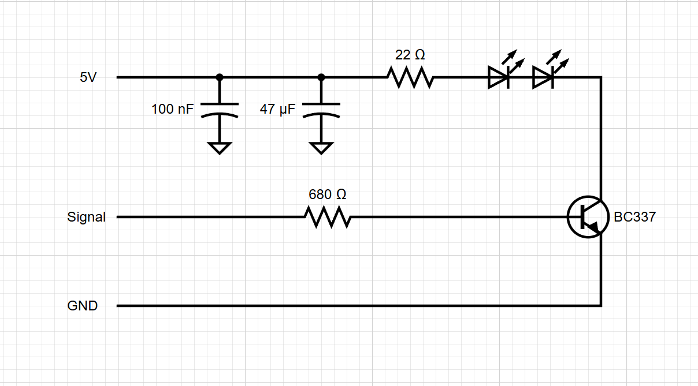
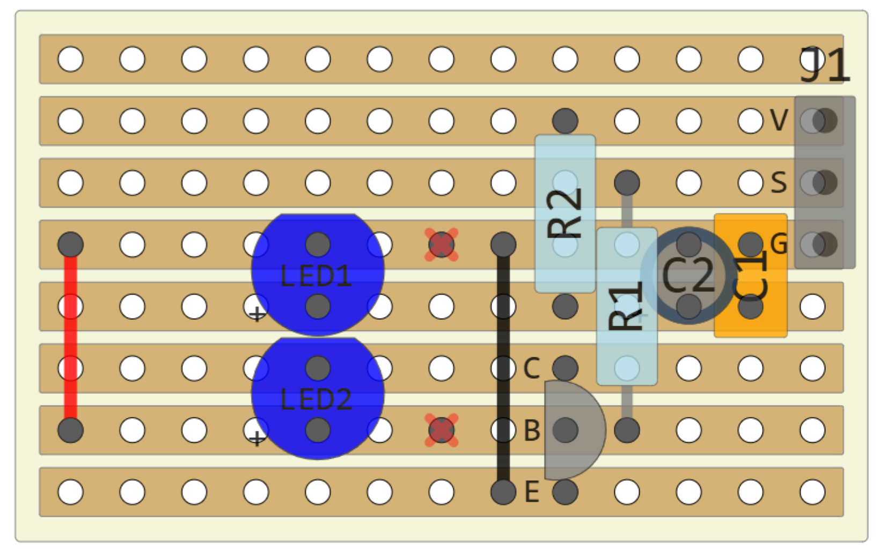
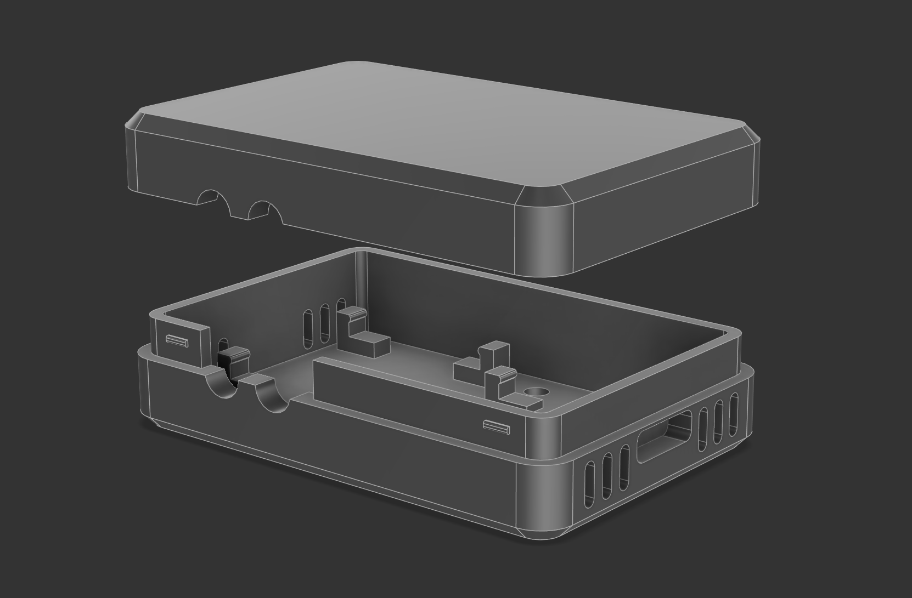

# irtx

A simple, Wifi enabled Infrared transmitter (aka "IR Blaster").


## Build the Circuit

The IR transmitter circuit is easy to build on a small piece of veroboard:

Parts:

* C1 - 100nf ceramic cap
* C2 - 47uF electrolytic cap
* R1 - 680R
* R2 - 22R (or 10R, or 5R)
* BC337 NPN transistor
* 2x IR LEDs (like [these](https://www.jaycar.com.au/5mm-infrared-transmitting-led/p/ZD1945))
* Veroboard 13x8 pins





Notes: 

* the above diagram shows a jumper J1 - it's just for labelling where to solder the wires that go to the ESP32.
* don't forget the two cut tracks indicated by red X
* if I was to rebuild this I'd probably move the red jumper wire at the left to just to the right of the LEDs.
* The leads to C2 need to be bent and the cap "laid down" to fit in the case (see photo below)
* The IR LEDs leads need to be bent so they face out the left side of the diagram. (see photo below)
* Leave the veroboard slightly oversized and file down later to fit the snap-in clips in the case.


## Print the Case



The case consists of three parts:

* [Top](./case/irtxcase-top.3mf)
* [Bottom](./case/irtxcase-bottom.3mf)
* [Clamp](./case/irtxcase-clamp.3mf)

You'll need a well calibrated printer to get the boards to clip in and the case to snap closed nicely.

The clamp is designed for a 15mm pole and requires:

* two M2.5 heat set inserts 
* two M2.5 6mm screws.

Or, design your own clamp for whereever you want to mount it to. The mounting holds are 26mm center-to-center. 

Fusion and 3mf files are the in the [./case](./case) subdirectory.

I printed the case in PLA, and the clamp in PETG.  You might be able to print it in ABS but I found the board clips too fragile.


## Connect the ESP32

There a three wires from the ESP32 Zero to the IR transmitter circuit.  

* The IR transmitter connection points are shown in the above stripboard image.

* The ESP32 Zero connections are to 5V and GND at the top left and signal to GPIO 4:

    


## Build Instructions

The firmware for the esp32 is an Arduino project.  To build

1. Install the `arduino-cli` tools

2. Install the board

    ```bash
    arduino-cli core update-index --additional-urls https://raw.githubusercontent.com/espressif/arduino-esp32/gh-pages/package_esp32_index.json
    arduino-cli core install esp32:esp32 --additional-urls https://raw.githubusercontent.com/espressif/arduino-esp32/gh-pages/package_esp32_index.json
    ```

3. Install libraries

    ```bash
    arduino-cli lib install "Adafruit NeoPixel"
    arduino-cli lib install "NimBLE-Arduino"
    ```

4. Build

    ```bash
    cd firmware
    ./build
    ```

5. Flash (replace com7 with your serial port)

    ```bash
    ./flash com7
    ```


## Configuring Device

Use a serial monitor program to configure the device.  The following serial terminal commands are available:

 *   `name <devicename>`          - set device name, takes effect after restart
 *   `setwifi <ssid> <password>`  - configure WiFi
 *   `status`                     - show device name, MAC, WiFi, IP


## UDP Protocol

To transmit an IR signal, send a UDP packet to port 4210 in the following format:

* `uint16_t cmd` - must be 1
* `uint16_t deviceIndex` - a user defined device index from 0 - 15 (see below)
* `uint32_t carrierFreq` - carrier frequency
* `uint32_t gap` - a trailing gap (see below)
* `uint16_t timingData[]` - IR code timing values

(all values are little endian)

The `cmd` value must be 1 and indicates this is an IR transmission packet

The `deviceIndex` is used to enforce gaps between consecutive packets targeted at the same device.  Can be just set to zero
to use the same gap timing between all.

The `carrierFrequency` must be `38000` otherwise the packet is ignored (might add support for others later)

The `gap` value is a minimum time (in microseconds) that the 
device will enforce between the end of one transmission and the start of the next.

The `timingData` is an array of microsecond timing values where odd indices are pulses and even indices are spaces.  If an odd number of values is passed an implicit zero gap is appended.

Note: pronto IR code definitions usually include the `gap` as the last space in the timing data (ie: `pulseSp).  It's recommended to pass that last space timing value as the `gap` parameter and set the trailing timing space to 0.
